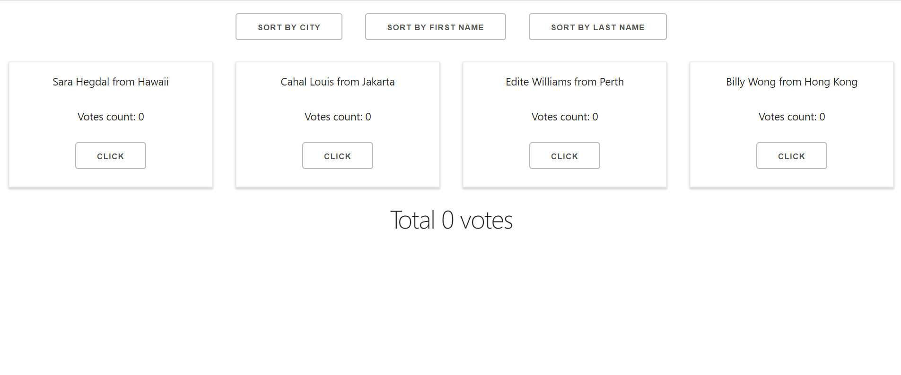
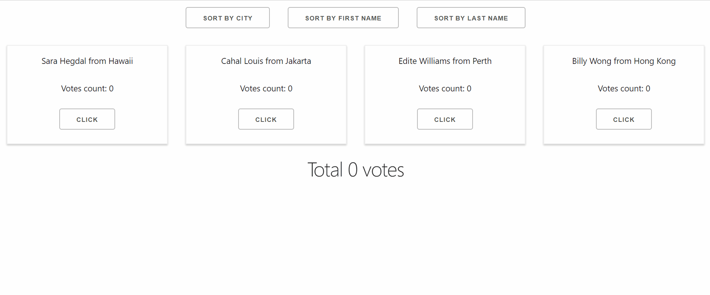

# Project Description

A ReactJS project that displays a group of candidates. The order to be displayed can be sorted by the candidate's name and the city they are present. Every time the button was clicked, the candidate got a vote. The votes can be counted in terms of each individual candidate as well as the total of all candidates.

# Project gif

This project was bootstrapped with [Create React App](https://github.com/facebook/create-react-app).

## Available Scripts

In the project directory, you can run:

### `npm start`

Runs the app in the development mode. 
Open [http://localhost:3000](http://localhost:3000) to view it in the browser.

The page will reload if you make edits. 
You will also see any lint errors in the console.
